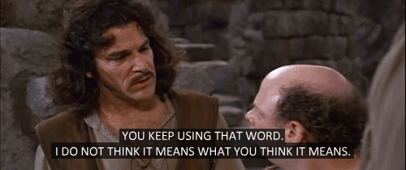

# [Topic Intro](#tutorial_TopicIntro)
Good lawyers, bad lawyers, and even people who have just watched a little bit of tv about lawyers know that the very first rule of Lawyer Club goes like this:<br>

"Don't ask a question if you don't already know the answer."<br>

Programmers, on the other hand, are all about that diving into the unknown / 'I wonder what happens if I push this button' life. Granted, we're not always great at "could've doesn't mean should've", but it isn't like the lawyers at theFacebook etc. do such a great job of slow-walking on that one either.<br>

<br>
*Can do or should do? Jury's still out on this one.*<br>

Even so, like just about everything else, this stuff works better when we find the common ground, and while some more experienced developers will probably disagree (and I hope if they do, they'll say something, because that's a great way to learn), at least to my thoroughly-warped-by-the-humanities way of thinking, automated testing and Test Driven Development (TDD) started to make a lot more sense once I started thinking of them like the second rule of Lawyer Club:<br>

"Don't ask a question if you don't already know the answer."<br>


In a nutshell TDD works the same way: *first* you write code that checks if the code you're going to write does what you want it to do, *then* write code that will pass the test. Take a quick look at a test in its simplest form, readable even if this is the very first time you're looking at JavaScript:<br>

True or False...<br>

```javascript
expect(1+2).toEqual(3)
```

No big deal, and to be fair, that's a calculation that mechanical computers were solving before the electric lightbulb was a thing (although back then they were called 'difference engines' which, frankly, sounds a lot cooler). So even though you *could* write and test the following function:<br>

```javascript
function add(a, b) { return a + b }
```

```javascript
expect( add(1, 2) ).toEqual(3)
```

you could also write...<br>

```javascript
function stepAdd(number, step) { return number + (number + step) }
```

and this time<br>

```javascript
expect( stepAdd(1, 2) ).toEqual(4)
```
or even<br>

```javascript
function powerUp(base, power) { return base ** power }
```
and this test will return true:<br>
```javascript
expect( powerUp(1,2) ).toEqual(1)
```
and this one will too:<br>
```javascript
expect( powerUp(2, powerUp(2, 3) )  ).toEqual(256)
```

Still. This is counting on your fingers stuff, so why do the extra work? After all, good programmers are *supposed* to be lazy. But it's lazy on our terms, so let's clear up a little of why we call laziness a virtue of a great programmer.[^1]<br>

<br>
*Laziness is a virtue? Inconceivable!*<br>

 Lazy means working smarter, doing anywhere from a little to a lot of thinking-work in order to get out of doing the stuff that's just mind-numbing and error prone repetition. Doing the work of writing tests, and  writing them first, turns out to be the lazy way to get ahead -- something that makes more sense the more you put it into action. Among other benefits, you'll see how it helps you catch problems *before* they become problems.<br>

 Laziness says leads us *first* to write what we *want* to happen, by writing a test:<br>

```javascript
expect( lookupCapital('Micronesia') ).toBe('Palikir')
```

...and then working backwards, figuring out the steps to solve the problem and testing them along the way. In this example, that means writing code that follows the steps a human who didn't know how that test should return might take to find out the answer.<br>

```javascript
function lookupCapital(someCountry) {

    // look up someCountry on wikipedia or google maps or wherever

    // then somehow figure out what the capital city is

    // send that answer back out to whoever called this function

  }
```

...and sure, figuring out a pattern to automate that does take some thought. But it's worth it, because running *multiple* tests and testing *multiple* values will let us know when our code isn't working the way we want.<br>

```javascript
function lookupCapital(someCountry) {

    return 'Palikir'

  }
```

...Works fine for the first test. Runs into problems when we try:<br>

```javascript
    expect( lookupCapital('RMI') ).not.toBe('Palikir')
```

...we could start extending the function to cover more cases:<br>

```javascript
function lookupCapital(someCountry) {

    if (someCountry === 'Micronesia') {

      return 'Palikir'

    } else {

      return "Where's that?"

    }
  }
```

...and extend that further by writing:<br>

```javascript
function lookupCapital(someCountry) {

    if (someCountry === 'Micronesia') {

      return 'Palikir'

    }

    if (someCountry === 'RMI') {

      return 'Majuro'

    }

    else {

      return "Where's that?"

    }

  }
```

...but we'd look like we didn't know any better when these two tests return false:<br>

```javascript
expect( lookupCapital('Marshall Islands') ).toBe('Majuro')
```

```javascript
expect( lookupCapital('FSM') ).toBe('Palikir')
```

and this one returns true:<br>

```javascript
expect( lookupCapital('Palau') ).toBe("Where's that?")
```

...and as programmers, we really *wouldn't* know any better if we wasted our time googling and then writing out 190+ 'if'/'else' handlers to cover each country in the world. To put it nicely, that would be... tedious. Not lazy. Error prone.<br>

Really what we're looking for is something that can go through a whole list of countries, and the different ways they can be abbreviated, and match up the results of their capitals (and probably think our way around more than a few edge conditions of spelling and world politics). These are all perfect candidates for problems automated testing can save us from having to work our way through down the road.<br>

It's like setting up hurdles before a track meet and then starting the race, instead of telling the runners "Ok, when the gun goes off, start running, and then every 50 feet or so, stride up a little more than a yard, and then afterwards we'll watch the replay to see how things turned out." Automated testing puts the hurdles out first, and then goes a step further and hangs a gong on each one to go off the moment a runner doesn't clear it. And also takes a picture to (prove || dispute) it after the race. It says "each pice of my App must clear its matching test, and if it doesn't, my App will tell me why not."<br>

There are tons of benefits to doing it, but the same can be said for exercising regularly and eating healthy -- the best sales pitch for automated testing, I think, is that even though it *seems* like extra work, it's actually the opposite. English teachers say the same thing about writing an outline before you write an essay (and they're correct), but this is way beyond that. TDD works like going into an exam with the answer to the question written beforehand, and then being able to write whatever question will answer it.<br>

1648? 206 * 8. The year the Treaty of Westphalia was signed. 1647 + 1.<br>

42? *.<br>

That's probably stretching it, and of course there are limits and some ways are better than others. But it definitely takes the hassle out of having to figure out what you need to do next when you're writing your code. You think about writing your tests, breaking a big abstract problem into manageable and specifically defined chunks, so that you can be lazy and work smarter-not-harder when you need to write the actual implementation code that solves the problem.<br>

That leads me back to the lawyer example from the start of this big top-level intro to the topic of Automated Testing and Test Driven Development: the winning litigators don't have to wonder about what the witness on the stand will answer, because they've done their work ahead of time. That frees them up to use their time in court to get exactly the testimony they want said in exactly the order that they want it heard by the judge and jury.<br>

...and when a witness tries to come up with some answer that doesn't match the story, knowing the expected answers inside and out beforehand sets a good lawyer up to jump on any mistake. That's what TDD does for programmers.<br>

In the next module I'll lay off the big picture metaphors and explanations and go straight into writing code and building out the App we're going to complete over the rest of this project.<br>

[**Next: Project Setup**](./tutorial_projectSetup.md)<br>

[^1]:
[The Three Virtues](http://threevirtues.com)<br>
